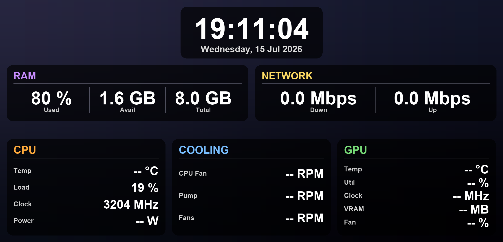

# panorama-overlay

Live PC telemetry overlay for the **Tryx Panorama SE 360 AIO** AMOLED display,
driven by [`reed-tpse`](https://github.com/fadli0029/reed-tpse).

Renders CPU · GPU · RAM · Network · Cooling stats plus a clock onto a base
image every N seconds and pushes each frame to the panel.



## What it shows

On the 2240×1080 AMOLED:

- **Top band** — clock + date
- **Middle strip** — RAM (Used% · Available · Total) · Network (Down · Up in Mbps)
- **Bottom row** — three panels:
  - **CPU** — Temp, Load, Clock, Package Power
  - **COOLING** — CPU Fan, Pump, Radiator Fans (optional Coolant Temp)
  - **GPU** — Temp, Util, Clock, VRAM, Fan%

## Requirements

- Linux
- Python 3.10+
- `reed-tpse` installed and working (`reed-tpse list` should succeed)
- `lm-sensors` — for pump / fan RPM
  - Debian/Ubuntu: `sudo apt install lm-sensors && sudo sensors-detect`
  - Arch: `sudo pacman -S lm_sensors && sudo sensors-detect`
  - Fedora: `sudo dnf install lm_sensors && sudo sensors-detect`
- NVIDIA GPU: `nvidia-smi` in `$PATH`
- AMD GPU: nothing extra — read from sysfs (`amdgpu`)
- CPU package power (optional): readable `intel-rapl` energy counter — a udev
  rule is provided (see below). Works for AMD Zen too (same kernel driver).

## Install

```bash
# From your reed-tpse checkout:
cd contrib/panorama-overlay
./install.sh
```

The installer does:

1. `pip install -r requirements.txt` (with `--break-system-packages` fallback on
   distros that need it)
2. Copies `udev/99-rapl-readable.rules` to `/etc/udev/rules.d/` and reloads
   udev (grants your user read access to the CPU energy counter)
3. Seeds `~/.config/panorama-overlay/config.yaml` from
   [`config.example.yaml`](config.example.yaml) if none exists
4. Installs the systemd **user** unit and enables it
5. `loginctl enable-linger $USER` so the overlay keeps running after logout

Follow logs:

```bash
journalctl --user -u panorama-overlay.service -f
```

## Configuration

All tuning lives in `~/.config/panorama-overlay/config.yaml`. See
[`config.example.yaml`](config.example.yaml) for the full annotated schema.

The tricky bit is telling the script which `lm-sensors` channels are your
pump, radiator fans, and CPU fan. The script can help you figure that out:

```bash
# Print detected fan/temp channels and a heuristic config suggestion.
python3 panorama_sensor_display.py --detect

# Write a starter config using the suggestions (edit the pump/fan lists as needed).
python3 panorama_sensor_display.py --init-config
```

Example `sensors:` block for an MSI board using the `nct6687` driver with a
Tryx Panorama plugged into the AIO_PUMP header:

```yaml
sensors:
  pump:          ["fan16"]        # highest-RPM channel, ~3000 RPM
  radiator_fans: ["fan1", "fan15"]
  cpu_fan:       ["fan2"]
```

Every CLI flag overrides its config file value:

```bash
python3 panorama_sensor_display.py \
  --interval 30 \
  --brightness 80 \
  --gpu nvidia \
  --base-image ./mylogo.png
```

## Preview a frame without pushing to the panel

```bash
python3 panorama_sensor_display.py --once --out /tmp/preview.png
```

## Notes

- **Frame dedup workaround**: `reed-tpse display` caches uploads by filename on
  the device, so this script writes uniquely-timestamped filenames each cycle
  and rolls off the oldest ones (`keep_on_device` in the config, default `3`).
- **Coolant temp**: The Tryx Panorama's Asetek pump does not expose coolant
  temperature over any Linux-visible channel. If you have a thermistor on a
  T_SENSOR header, put its feature name in `sensors.coolant_temp` and a
  "Coolant" row will appear in the COOLING panel.
- **GPU auto-detect** on hybrid systems (dGPU + iGPU) can pick the wrong
  device. Pin it explicitly with `--gpu nvidia` or `--gpu amd` (or in the
  config file).
- **Background image**: A neutral 2240×1080 dark-gradient PNG ships in
  `assets/`. Drop in your own via `base_image:` in the config or `--base-image`.

## Layout / display specs

The panel is **2240×1080**. All layout constants live near the top of
`panorama_sensor_display.py` (`MARGIN`, `PANEL_H`, `PANEL_RADIUS`, etc.). Value
fonts auto-shrink per row, so long strings never overflow.

## License

MIT — same as reed-tpse.
